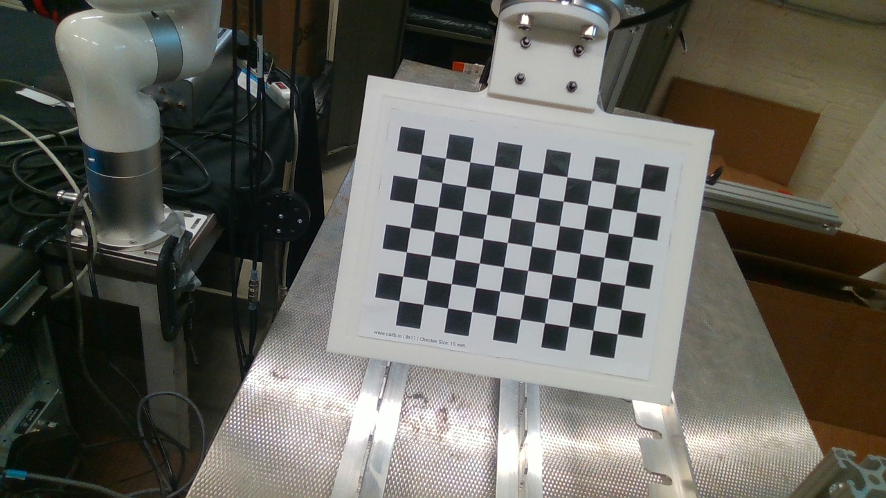

# 机器人手眼标定项目

这是一个基于Intel RealSense D435相机 的 UFACTORY XARM 机器人手眼标定 项目，支持眼在手内和眼在手外两种标定模式。


*机器人手眼标定系统概览*

## 项目结构

```
calibration/
├── API/                          # API模块
│   └── UF.py                     # UFACTORY XARM 机械臂控制 API
├── data_collection_d435_win/     # 数据采集模块
│   ├── main.py                   # 主采集程序
│   └── images/                   # 采集的标定板图像合集
├── eye_in_hand_homogeneous_matrix/  # 眼在手内标定（相机安装在机械臂末端（手部））
│   ├── main.py                   # 眼在手内标定主程序
│   ├── camera_data.py            # 相机数据处理
│   ├── save_poses.py             # 位姿保存模块
│   └── RobotToolPose.csv         # 机械臂末端位姿数据
├── out_of_hand_homogeneous_matrix/ # 眼在手外标定 （相机固定安装在工作台上（手外））
│   ├── main.py                   # 眼在手外标定主程序
│   ├── camera_data.py            # 相机数据处理
│   ├── save_poses2.py            # 位姿保存模块
│   └── RobotToolPose.csv         # 机械臂末端位姿数据
├── test.py                       # 相机内参测试程序
├── transfer.py                   # 数据转换工具
└── README.md                     # 项目说明文档
```

## 功能特性

### 1. 数据采集
- 使用Intel RealSense D435相机进行实时图像采集
- 支持按's'键保存图像和对应的机械臂位姿
- 自动生成标定板图像序列和位姿文件

### 2. 眼在手内标定 (Eye-in-Hand)
- 计算相机坐标系相对于机械臂末端坐标系的变换矩阵
- 使用OpenCV的`calibrateHandEye`函数
- 支持TSAI算法进行手眼标定

### 3. 眼在手外标定 (Eye-to-Hand)
- 计算相机坐标系相对于机械臂基座坐标系的变换矩阵
- 同样使用OpenCV的`calibrateHandEye`函数
- 适用于相机固定安装的场景

### 4. 相机内参标定
- 自动计算相机内参矩阵和畸变系数
- 支持棋盘格标定板
- 可配置标定板参数（角点数量、格子大小等）

## 环境准备

### 系统要求
- Windows 10/11
- Python 3.7+
- Intel RealSense D435相机
- xArm机械臂（或其他兼容机械臂）

### 硬件连接
1. **相机连接**：将RealSense D435通过USB 3.0连接到电脑
2. **机械臂连接**：确保机械臂通过以太网连接到同一网络
3. **标定板准备**：准备棋盘格标定板（见标定板配置部分）

## 详细安装步骤

### 1. 克隆项目
```bash
git clone https://github.com/David-Kingsman/calibration.git
cd calibration
```

### 2. 安装Python依赖
```bash
# 安装基础依赖
pip install numpy opencv-python scipy

# 安装RealSense SDK
pip install pyrealsense2

# 如果上述命令失败，请先安装RealSense SDK：
# 1. 下载并安装Intel RealSense SDK
# 2. 然后运行：pip install pyrealsense2
```

### 3. 验证安装
```bash
# 测试相机连接
python test.py

# 如果看到相机参数输出，说明安装成功
```

## 完整标定流程

### 步骤1: 数据采集

#### 1.1 准备标定板
- **眼在手内标定**：11×8棋盘格，30mm格子大小
- **眼在手外标定**：10×7棋盘格，14mm格子大小
- 确保标定板平整，无折痕，角点清晰

#### 1.2 启动数据采集
```bash
cd data_collection_d435_win
python main.py
```

#### 1.3 采集操作指南
1. 程序启动后会显示相机画面
2. 将标定板放在相机视野内
3. 调整机械臂到不同位置和角度
4. 按 **'s'** 键保存当前图像和位姿
5. 重复步骤3-4，建议采集20-50张图像
6. 按 **'q'** 键退出程序

#### 1.4 验证采集结果
```bash
# 检查采集的图像
ls data_collection_d435_win/images/

# 检查位姿文件
cat data_collection_d435_win/images/poses.txt
```

### 步骤2: 眼在手内标定

#### 2.1 运行标定程序
```bash
cd eye_in_hand_homogeneous_matrix
python main.py
```

#### 2.2 检查输出结果
程序运行后会输出：
- 相机内参矩阵
- 畸变系数
- 手眼变换矩阵

#### 2.3 验证结果文件
```bash
# 检查生成的文件
ls data_collection_d435_win/images/
# 应该看到：CameraIntrinsics.txt, Camera2End.txt
```

### 步骤3: 眼在手外标定

#### 3.1 运行标定程序
```bash
cd out_of_hand_homogeneous_matrix
python main.py
```

#### 3.2 检查输出结果
程序运行后会输出：
- 相机内参矩阵
- 畸变系数
- 手眼变换矩阵

### 步骤4: 结果验证

#### 4.1 测试相机内参
```bash
cd ..
python test.py
```

#### 4.2 检查所有输出文件
```bash
# 检查相机内参
cat data_collection_d435_win/images/CameraIntrinsics.txt

# 检查手眼变换矩阵
cat data_collection_d435_win/images/Camera2End.txt

# 检查位姿数据
cat data_collection_d435_win/images/poses.txt
```

## 标定板配置

| 标定模式 | 棋盘格尺寸 | 格子大小 | 用途 |
|----------|------------|----------|------|
| 眼在手内 | 11×8 | 30mm | 相机安装在机械臂末端 |
| 眼在手外 | 10×7 | 14mm | 相机固定安装在工作台 |

## 输出结果说明

### 文件结构
```
data_collection_d435_win/images/
├── 0.jpg, 1.jpg, ..., N.jpg     # 采集的标定板图像
├── poses.txt                     # 机械臂位姿数据
├── CameraIntrinsics.txt          # 相机内参矩阵
└── Camera2End.txt               # 手眼变换矩阵
```

### 数据格式
- **poses.txt**: 每行包含6个数值 [x, y, z, rx, ry, rz]
- **CameraIntrinsics.txt**: 3×3相机内参矩阵
- **Camera2End.txt**: 4×4齐次变换矩阵

## 常见问题解决

### 1. 相机连接问题
```bash
# 问题：无法检测到RealSense相机
# 解决步骤：
# 1. 检查USB连接（确保使用USB 3.0端口）
# 2. 重新安装RealSense SDK
# 3. 重启电脑
# 4. 运行测试程序验证
python test.py
```

### 2. 机械臂连接问题
```bash
# 问题：无法连接到机械臂
# 解决步骤：
# 1. 检查网络连接
# 2. 修改API/UF.py中的IP地址
# 3. 确保机械臂处于可控制状态
# 4. 测试连接
python -c "from API.UF import UF; arm = UF(); print(arm.get_pose())"
```

### 3. 角点检测失败
```bash
# 问题：无法检测到标定板角点
# 解决步骤：
# 1. 确保标定板平整，无折痕
# 2. 调整光照条件，避免反光
# 3. 检查标定板参数设置
# 4. 确保标定板完全在相机视野内
# 5. 尝试不同的角度和距离
```

### 4. 标定精度低
```bash
# 问题：标定结果精度不高
# 解决步骤：
# 1. 增加采集图像数量（建议30-50张）
# 2. 确保机械臂位姿多样性
# 3. 检查标定板质量
# 4. 验证角点检测准确性
# 5. 重新进行数据采集
```

## 调试技巧

### 1. 检查数据质量
```python
# 在标定前检查角点检测结果
import cv2
import numpy as np

# 读取图像
img = cv2.imread('data_collection_d435_win/images/0.jpg')
gray = cv2.cvtColor(img, cv2.COLOR_BGR2GRAY)

# 检测角点
ret, corners = cv2.findChessboardCorners(gray, (11, 8), None)
if ret:
    cv2.drawChessboardCorners(img, (11, 8), corners, ret)
    cv2.imshow('Corners', img)
    cv2.waitKey(0)
    cv2.destroyAllWindows()
```

### 2. 验证位姿数据
```python
# 检查机械臂位姿数据格式
import numpy as np

# 读取位姿数据
poses = np.loadtxt('data_collection_d435_win/images/poses.txt', delimiter=',')
print(f"位姿数据形状: {poses.shape}")
print(f"第一个位姿: {poses[0]}")
```

### 3. 标定结果验证
```python
# 检查变换矩阵的有效性
import numpy as np

# 读取变换矩阵
camera2end = np.loadtxt('data_collection_d435_win/images/Camera2End.txt')
R = camera2end[:3, :3]
t = camera2end[:3, 3]

print(f"旋转矩阵行列式: {np.linalg.det(R)}")
print(f"平移向量: {t}")
print(f"变换矩阵:\n{camera2end}")
```

## 技术原理

手眼标定基于以下方程：
- 眼在手内：A₂⁻¹ × A₁ × X = X × B₂ × B₁⁻¹
- 眼在手外：A₂⁻¹ × A₁ × X = X × B₂ × B₁⁻¹

其中：
- A₁, A₂：机械臂末端在不同位置的变换矩阵
- B₁, B₂：标定板在相机坐标系下的变换矩阵
- X：待求解的手眼变换矩阵

## 许可证

本项目仅供学习和研究使用。

## 作者

机器人视觉标定项目